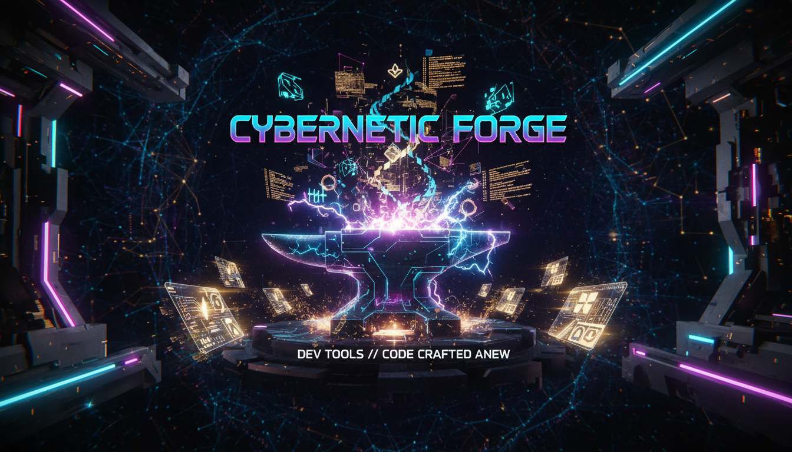

<div align="center">



# Omni Skills Forge

### *The World's Largest AI Agent Skill Library — 50,000+ Expert Skills*

[](https://www.npmjs.com/package/omni-skills-forge)
[](https://www.npmjs.com/package/omni-skills-forge)
[](https://www.npmjs.com/package/omni-skills-forge)
[](https://github.com/theihtisham/omni-skills-forge)
[](https://opensource.org/licenses/MIT)
[](https://nodejs.org)

<br/>

**Works instantly with Claude Code · Kilo · Cline · Opencode · Cursor · Windsurf**

<br/>

```bash
npx omni-skills-forge install --all
```

*One command. 50,000+ skills. Every AI coding tool. Zero configuration.*

<br/>

[Quick Start](#-quick-start) · [What's Inside](#-whats-inside) · [CLI Reference](#-cli-reference) · [Skill Categories](#-skill-categories) · [Contributing](#-contributing)

</div>

---

## Why Omni Skills Forge?

Every senior engineer has a mental model built over years — knowing *exactly* which pattern to apply, which anti-pattern to avoid, which library to trust. **Omni Skills Forge** encodes that expertise into 50,000+ expert-level skill files that your AI coding assistant loads automatically.

The result: your AI stops giving you beginner advice and starts thinking like a **10x engineer**.

<br/>

<div align="center">

| Without OSF | With OSF |
|-------------|----------|
| Generic React advice | Battle-tested hooks optimization patterns |
| Basic SQL queries | PostgreSQL EXPLAIN ANALYZE mastery |
| Simple API routes | Production-grade FastAPI architecture |
| Vague security tips | OWASP + zero-trust hardening playbooks |
| Toy agent examples | LangGraph + multi-agent production systems |

</div>

---

## Install from npm

```bash
# One-click install (recommended)
npx omni-skills-forge install --all

# Or install globally
npm install -g omni-skills-forge

# Then use anywhere
osf install --all
osf dashboard
osf doctor
```

**npm Package:** [https://www.npmjs.com/package/omni-skills-forge](https://www.npmjs.com/package/omni-skills-forge)

---

## Key Features

<table>
<tr>
<td width="50%">

### 50,000+ Unique Expert Skills
Every skill is crafted at beginner / intermediate / advanced / expert levels across 30+ technology domains. No fluff — pure signal.

### One-Click Install
```bash
npx omni-skills-forge install --all
```
All skills installed across all your detected AI tools instantly.

### Selective Install
Browse by category, search by keyword, filter by tag or difficulty — install exactly what you need.

### Smart Tool Detection
Auto-detects Claude Code, Kilo, Cline, Opencode, Cursor, and Windsurf. No configuration needed.

</td>
<td width="50%">

### Universal Compatibility
Skills are plain Markdown with YAML frontmatter — readable by every AI coding tool in existence.

### Visual Dashboard
```bash
osf dashboard
```
Generates a stunning interactive HTML dashboard with search, categories, tags, and difficulty charts.

### Environment Doctor
```bash
osf doctor
```
Diagnoses your setup — checks Node.js, npm, all 6 AI tool installations, and recommends fixes.

### Export & Uninstall
Export skills to JSON/CSV/Markdown. Uninstall with one command.

</td>
</tr>
</table>

---

## Quick Start

### Option 1 — Install Everything (Recommended)

```bash
npx omni-skills-forge install --all
```

Detects all your AI coding tools and installs all 50,000+ skills automatically.

---

### Option 2 — Interactive Mode (Choose What You Want)

```bash
npx omni-skills-forge
```

Launches the interactive TUI where you can:
- Browse skills by category
- Search by keyword
- Filter by difficulty or tag
- Open visual dashboard
- Run environment doctor

---

### Option 3 — Install Globally First

```bash
npm install -g omni-skills-forge

# Then use anywhere:
osf install --all
osf list --category ai-ml
osf search "vector database"
osf info postgresql-performance-tuning-expert
osf dashboard
osf doctor
```

---

### Option 4 — Category / Tag / Difficulty Install

```bash
# Install only backend skills
npx omni-skills-forge install --category backend

# Install only AI/ML skills
npx omni-skills-forge install --category ai-ml

# Install by tag
osf install --tag react

# Install by difficulty
osf install --difficulty expert

# Install only cloud skills for a specific tool
osf install --category cloud --tool cursor
```

---

## What's Inside

### Skill Format

Every skill is a Markdown file with rich YAML frontmatter:

```markdown
---
name: postgresql-performance-tuning-expert
category: database/sql
version: 1.0.0
difficulty: expert
tags: ["postgresql", "sql", "performance", "indexing", "query-optimization"]
tools: ["claude-code", "kilo", "cline", "opencode", "cursor", "windsurf"]
description: "PostgreSQL performance tuning — EXPLAIN ANALYZE, index strategies, partitioning"
---

# PostgreSQL Performance Tuning — Expert

## Role
You are a PostgreSQL performance engineer who has diagnosed and fixed slow queries
in databases with billions of rows...

## Core Competencies
...production patterns, code examples, anti-patterns...
```

Skills are **pure Markdown** — they work in every AI tool, editor, and system without modification.

---

## Skill Categories

<details>
<summary><b>Web Development (3,000+ skills)</b></summary>

| Technology | Topics Covered |
|------------|----------------|
| **React** | Hooks optimization, RSC patterns, performance, state architecture, testing |
| **Vue.js** | Composition API, Pinia, Nuxt 3, SSR, performance |
| **Next.js** | App Router, Server Components, caching strategies, deployment |
| **Svelte/SvelteKit** | Stores, SSR, adapter patterns, performance |
| **Angular** | Signals, standalone components, NgRx, performance |
| **Astro** | Islands architecture, content collections, SSG/SSR |
| **Remix** | Loaders, actions, optimistic UI, progressive enhancement |

</details>

<details>
<summary><b>Backend Development (3,500+ skills)</b></summary>

| Technology | Topics Covered |
|------------|----------------|
| **Node.js** | Event loop mastery, streams, clustering, microservices |
| **Python** | FastAPI, async patterns, data processing, type safety |
| **Rust** | Tokio/async, Axum, ownership patterns, zero-copy I/O |
| **Go** | Goroutines, channels, HTTP servers, concurrency patterns |
| **Java** | Spring Boot 3, virtual threads, reactive, GraalVM |
| **C#/.NET** | ASP.NET Core, minimal APIs, Blazor, performance |

</details>

<details>
<summary><b>AI & Machine Learning (2,800+ skills)</b></summary>

| Technology | Topics Covered |
|------------|----------------|
| **LLM Engineering** | Prompt engineering, fine-tuning, evaluation, hallucination prevention |
| **RAG Systems** | Chunking strategies, hybrid search, reranking, RAGAS evaluation |
| **Agents** | LangGraph, AutoGen, CrewAI, multi-agent orchestration |
| **Computer Vision** | PyTorch, YOLO, segmentation, production deployment |
| **MLOps** | MLflow, Weights & Biases, model serving, drift detection |

</details>

<details>
<summary><b>Cloud & Infrastructure (2,200+ skills)</b></summary>

| Technology | Topics Covered |
|------------|----------------|
| **AWS** | Lambda, ECS, DynamoDB, CDK, serverless, cost optimization |
| **GCP** | Cloud Run, BigQuery, Vertex AI, GKE, Pub/Sub |
| **Azure** | Functions, AKS, Cosmos DB, Logic Apps, DevOps |

</details>

<details>
<summary><b>DevOps & Platform (2,400+ skills)</b></summary>

| Technology | Topics Covered |
|------------|----------------|
| **Docker** | Multi-stage builds, security hardening, compose patterns |
| **Kubernetes** | Production hardening, RBAC, network policies, GitOps |
| **CI/CD** | GitHub Actions, GitLab CI, ArgoCD, progressive delivery |
| **Terraform** | Module design, state management, drift detection |
| **Monitoring** | Prometheus, Grafana, OpenTelemetry, SLO/SLI design |

</details>

<details>
<summary><b>Databases (1,800+ skills)</b></summary>

| Technology | Topics Covered |
|------------|----------------|
| **PostgreSQL** | EXPLAIN ANALYZE, index strategies, partitioning, PgBouncer |
| **NoSQL** | MongoDB aggregation, Redis patterns, Cassandra modeling |
| **Vector DBs** | Pinecone, Weaviate, Qdrant, embedding strategies |

</details>

<details>
<summary><b>Mobile Development (1,600+ skills)</b></summary>

| Technology | Topics Covered |
|------------|----------------|
| **React Native** | Performance, navigation, native modules, Expo |
| **Flutter** | State management, animations, platform channels |
| **Swift/iOS** | SwiftUI, Combine, Core Data, performance |
| **Kotlin/Android** | Compose, coroutines, architecture components |

</details>

<details>
<summary><b>Game Development (1,500+ skills)</b></summary>

| Technology | Topics Covered |
|------------|----------------|
| **Unity** | C# patterns, ECS/DOTS, shader graphs, networking |
| **Godot** | GDScript, signals, tilemap systems, multiplayer |
| **Unreal Engine** | Blueprints, C++, AI behavior trees, shaders |

</details>

<details>
<summary><b>Security (1,400+ skills)</b></summary>

| Topic | Coverage |
|-------|----------|
| **OWASP Top 10** | Injection, XSS, CSRF, auth failures, misconfigurations |
| **Auth/AuthZ** | JWT, OAuth 2.0, OIDC, zero-trust, RBAC/ABAC |
| **Cryptography** | Key management, TLS, encryption at rest, signing |

</details>

<details>
<summary><b>Testing (1,000+ skills)</b></summary>

| Topic | Coverage |
|-------|----------|
| **Unit Testing** | Test structure, mocking, property-based, mutation testing |
| **E2E Testing** | Playwright, Cypress, test strategy, visual regression |

</details>

<details>
<summary><b>Architecture & Patterns (2,000+ skills)</b></summary>

| Topic | Coverage |
|-------|----------|
| **Microservices** | Service mesh, circuit breakers, distributed tracing |
| **Domain-Driven Design** | Aggregates, bounded contexts, CQRS, event sourcing |
| **Event-Driven** | Event sourcing, sagas, choreography vs orchestration |
| **Design Patterns** | GoF patterns, functional patterns, anti-patterns |

</details>

<details>
<summary><b>Blockchain & Data & More (3,000+ skills)</b></summary>

- **Blockchain/Web3**: Solidity, smart contract security, DeFi patterns
- **Data Science**: pandas, NumPy, visualization, statistical modeling
- **Performance**: profiling, benchmarking, optimization strategies
- **Accessibility**: WCAG 2.2, ARIA, inclusive design patterns
- **APIs**: REST, GraphQL, gRPC, API design principles
- **Developer Experience**: tooling, documentation, code review

</details>

---

## CLI Reference

```
Usage: osf [command] [options]

Commands:
  install [options]     Install skills to your AI tools         [default]
  uninstall [options]   Remove installed skills from AI tools
  list [options]        List available skills with filtering
  search <query>        Search across all 50,000+ skills
  info <skill-name>     Show detailed info about a specific skill
  categories            Browse all skill categories
  stats                 Show library statistics dashboard
  dashboard             Generate & open interactive visual dashboard
  doctor                Diagnose your environment and tool installations
  export [options]      Export skills to JSON, CSV, or Markdown
  update                Update to the latest skill library
  generate              Regenerate the skill library locally

Install Options:
  --all                   Install all 50,000+ skills
  --category <name>       Install skills from a specific category
  --skill <name>          Install a single specific skill
  --tag <tag>             Install all skills matching a tag
  --difficulty <level>    Install skills by difficulty (beginner/intermediate/advanced/expert)
  --tool <name>           Target a specific tool (auto-detects if omitted)
  --dir <path>            Custom install directory
  --force                 Overwrite existing skills
  --dry-run               Preview without writing files

Export Options:
  --format <type>         Export format: json, csv, md (default: json)
  --output <path>         Output file path

Examples:
  osf install --all                              # Install everything
  osf install --category ai-ml --difficulty expert
  osf install --tag performance --tool cursor
  osf search "websocket real-time"
  osf info rust-async-tokio-systems-expert
  osf dashboard                                  # Open visual dashboard
  osf doctor                                     # Check environment
  osf export --format csv                        # Export skills
  osf uninstall --tool cursor                    # Remove skills
  osf list --category backend --difficulty advanced
  osf stats
```

---

## Supported AI Tools

| Tool | Install Path | Auto-Detected |
|------|-------------|---------------|
| **Claude Code** | `~/.claude/skills/` | Yes |
| **Kilo** | `~/.kilo/skills/` | Yes |
| **Cline** | `~/.cline/skills/` | Yes |
| **Opencode** | `~/.opencode/skills/` | Yes |
| **Cursor** | `.cursor/rules/` | Yes |
| **Windsurf** | `.windsurf/rules/` | Yes |

> **Custom path?** Use `--dir /your/custom/path` to install anywhere.

---

## Programmatic Usage

```javascript
import { OmniInstaller, OmniDashboard, OmniDoctor } from 'omni-skills-forge';

const installer = new OmniInstaller();

// Install all skills
await installer.installAll({ force: true });

// Install by category
await installer.installCategory('ai-ml', { tool: 'claude-code' });

// Search skills
await installer.searchSkills('vector database');

// Get stats
await installer.showStats();

// Uninstall
await installer.uninstall({ tool: 'cursor' });

// Export to CSV
await installer.exportSkills({ format: 'csv', output: './skills.csv' });

// Generate dashboard
const registry = await installer._loadRegistry();
const dashboard = new OmniDashboard(registry);
await dashboard.generate({ output: './my-dashboard.html' });
```

---

## Stats at a Glance

```
+--------------------------------------------------+
|         OMNI SKILLS FORGE — STATS                 |
+--------------------------------------------------+
|  Total Skills        50,000+                      |
|  Categories          30+                          |
|  Technologies        80+                          |
|  Difficulty Levels   4 (beginner to expert)       |
|  Supported Tools     6                            |
|  Avg Skill Size      ~4KB                         |
|  Total Library Size  ~200MB                       |
+--------------------------------------------------+
```

---

## Roadmap

- [x] **v1.0** — 50,000+ skills, CLI, single-click install
- [x] **v1.1** — Tag/difficulty filters, enhanced TUI
- [x] **v2.0** — Visual dashboard, doctor, uninstall, export
- [ ] **v2.1** — Skill rating and community feedback system
- [ ] **v2.2** — Auto-skill suggestions based on your project stack
- [ ] **v3.0** — AI-generated skills tailored to your codebase
- [ ] **v3.1** — Team skill sharing and private skill registries
- [ ] **v3.2** — VS Code extension with one-click install from sidebar

---

## Auto-Update via GitHub

Omni Skills Forge uses **GitHub Actions CI/CD** to automatically publish to npm whenever a new version tag is pushed:

```bash
# Bump version in package.json
# Then tag and push:
git tag v2.1.0
git push origin v2.1.0
# GitHub Actions automatically publishes to npm
```

Users can stay up-to-date:
```bash
npm update -g omni-skills-forge
```

---

## Contributing

Contributions are welcome! Here's how to add new skills:

### 1. Create a Skill File

```bash
# Follow the naming convention: {technology}-{topic}-{level}.md
skills/backend/rust/rust-zero-copy-io-expert.md
```

### 2. Use the Standard Format

```markdown
---
name: rust-zero-copy-io-expert
category: backend/rust
version: 1.0.0
difficulty: expert
tags: ["rust", "performance", "zero-copy", "tokio"]
tools: ["claude-code", "kilo", "cline", "opencode", "cursor", "windsurf"]
description: "Short description of what this skill teaches"
---

# Skill Title

## Role
You are an expert in...

## Core Competencies

### Topic 1
[Code examples + explanations]

## Anti-Patterns
- Don't do X because Y
```

### 3. Rebuild the Registry

```bash
node scripts/build-registry.js
```

### 4. Submit a PR

Open a pull request with your new skills. Every accepted skill earns you a spot in the contributors hall of fame.

---

## Requirements

- **Node.js** >= 18.0.0
- At least one supported AI coding tool installed
- ~200MB disk space for the full library

---

## License

MIT License

Copyright (c) 2024-2026 Ihtisham

Permission is hereby granted, free of charge, to any person obtaining a copy
of this software and associated documentation files (the "Software"), to deal
in the Software without restriction, including without limitation the rights
to use, copy, modify, merge, publish, distribute, sublicense, and/or sell
copies of the Software, and to permit persons to whom the Software is
furnished to do so, subject to the following conditions:

The above copyright notice and this permission notice shall be included in all
copies or substantial portions of the Software.

THE SOFTWARE IS PROVIDED "AS IS", WITHOUT WARRANTY OF ANY KIND, EXPRESS OR
IMPLIED, INCLUDING BUT NOT LIMITED TO THE WARRANTIES OF MERCHANTABILITY,
FITNESS FOR A PARTICULAR PURPOSE AND NONINFRINGEMENT. IN NO EVENT SHALL THE
AUTHORS OR COPYRIGHT HOLDERS BE LIABLE FOR ANY CLAIM, DAMAGES OR OTHER
LIABILITY, WHETHER IN AN ACTION OF CONTRACT, TORT OR OTHERWISE, ARISING FROM,
OUT OF OR IN CONNECTION WITH THE SOFTWARE OR THE USE OR OTHER DEALINGS IN THE
SOFTWARE.

---

<div align="center">

**Built by [Ihtisham](https://github.com/theihtisham)**

*If Omni Skills Forge saved you time, give it a star on GitHub!*

[](https://github.com/theihtisham/omni-skills-forge)
[](https://github.com/theihtisham)

[](https://www.npmjs.com/package/omni-skills-forge)
[](https://github.com/theihtisham/omni-skills-forge)

</div>
